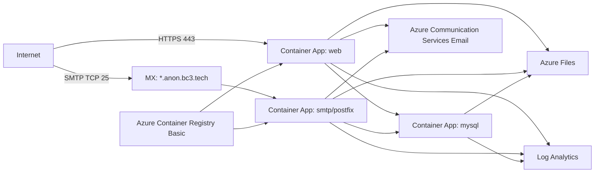

# Azure deployment

This `azd` stack deploys the existing AnonAddy containers to Azure with the lowest practical resource count.

## Topology



## Cost-first choices

- Azure Container Apps consumption is used for web and SMTP containers.
- The web app defaults to `minReplicas = 0`.
- The SMTP and MySQL apps also default to `minReplicas = 0` for cheapest deployment, but you should raise them to `1` if cold starts cause dropped SMTP connections or DB timeouts.
- Redis is intentionally omitted. The Azure environment uses:
  - `QUEUE_CONNECTION=sync`
  - `CACHE_DRIVER=file`
  - `SESSION_DRIVER=file`
- MySQL runs as a container with Azure Files persistence to avoid the fixed cost of Azure Database for MySQL Flexible Server.

## Reliability tradeoffs

The cheapest MySQL option is not the most durable option. MySQL on Azure Files is acceptable only for a low-traffic personal deployment where cost matters more than managed database guarantees. For a more reliable deployment, replace the MySQL container with Azure Database for MySQL Flexible Server Burstable B1ms and expect roughly another $15/month.

SMTP cold starts may delay or reject the first connection after idle. If this happens, set:

```bicep
param mailMinReplicas = 1
param mysqlMinReplicas = 1
```

## Required azd environment values

Set these before `azd up`:

```powershell
azd env set AZURE_LOCATION westus3
azd env set APP_URL https://anon.bc3.tech
azd env set ANONADDY_DOMAIN anon.bc3.tech
azd env set ANONADDY_ALL_DOMAINS anon.bc3.tech
azd env set ANONADDY_HOSTNAME mail.anon.bc3.tech
azd env set ANONADDY_ADMIN_USERNAME me2
azd env set ANONADDY_RETURN_PATH mailer@bc3.tech
azd env set MAIL_FROM_NAME AnonAddy
azd env set MAIL_FROM_ADDRESS DoNotReply@anon.bc3.tech
azd env set MAIL_ACS_ENDPOINT https://hurlburt-commsvc.unitedstates.communication.azure.com/
azd env set-secret APP_KEY '<base64 app key>'
azd env set-secret ANONADDY_SECRET '<long random secret>'
azd env set-secret BLOCKLIST_API_SECRET '<long random secret>'
azd env set-secret DB_PASSWORD '<mysql password>'
azd env set-secret MYSQL_ROOT_PASSWORD '<mysql root password>'
azd env set-secret MAIL_ACS_ACCESS_KEY '<acs access key>'
```

Then run:

```powershell
azd provision --preview
azd up
```

The `postprovision` hook builds the existing Dockerfile targets and updates the Container Apps:

- `app-runtime` -> `anonaddy-app`
- `mail-runtime` -> `anonaddy-mail`

By default the hook builds `linux/amd64`. Override with:

```powershell
$env:AZURE_IMAGE_PLATFORM='linux/amd64,linux/arm64'
azd up
```

## DNS

After deployment, get the SMTP hostname:

```powershell
azd env get-value SMTP_HOSTNAME
```

Point wildcard MX to that host:

```dns
*.anon.bc3.tech. MX 10 <SMTP_HOSTNAME>.
```

The web hostname can use the Container Apps default URL from:

```powershell
azd env get-value APP_INGRESS_URL
```

Add a Container Apps custom domain later if you want `https://anon.bc3.tech` directly on the app.

## Rough monthly cost estimate

| Resource | Assumption | Estimated monthly cost |
|---|---:|---:|
| Azure Container Registry Basic | 1 registry | ~$5 |
| Azure Files Standard LRS | ~25 GiB allocated quota, light transactions | ~$1-3 |
| Log Analytics | Daily cap 0.1 GiB, low traffic | ~$0-8 |
| Container Apps web/mail/mysql | Min replicas 0, low traffic | ~$0-5 |
| Container Apps if mail+mysql min replicas 1 | 0.25 vCPU / 0.5 GiB each, idle | ~$15-30 |

Cheapest expected idle cost is roughly **$6-16/month**. Reliability mode with always-on SMTP and MySQL is closer to **$25-45/month**.
