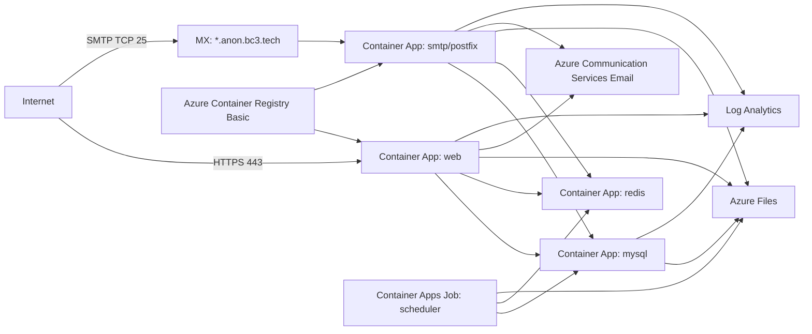

# Azure deployment

This `azd` stack deploys the existing AnonAddy containers to Azure with the lowest practical resource count.

## Topology



## Cost-first choices

- Azure Container Apps consumption is used for web and SMTP containers.
- The web app defaults to `minReplicas = 0`.
- The SMTP and MySQL apps default to `minReplicas = 0` for cheapest deployment, but you should raise them to `1` if cold starts cause dropped SMTP connections or DB timeouts.
- Redis runs as a small internal Container App because the application calls `Redis::throttle()` directly for email and alias rate limiting.
- A scheduled Container Apps Job runs `php artisan schedule:run` every five minutes. This avoids an always-on scheduler container.
- Dedicated queue workers are intentionally omitted. The Azure environment uses `QUEUE_CONNECTION=sync` to avoid an always-on worker replica.
- The Azure environment uses:
  - `QUEUE_CONNECTION=sync`
  - `CACHE_DRIVER=redis`
  - `SESSION_DRIVER=redis`
- MySQL runs as a container with Azure Files persistence to avoid the fixed cost of Azure Database for MySQL Flexible Server.
- Postfix spool stays on the container filesystem. Azure Files uses SMB semantics that conflict with Postfix ownership checks, so persistent storage is only used for app storage, mail logs, and generated TLS certs.

## Reliability tradeoffs

The cheapest MySQL option is not the most durable option. MySQL on Azure Files is acceptable only for a low-traffic personal deployment where cost matters more than managed database guarantees. For a more reliable deployment, replace the MySQL container with Azure Database for MySQL Flexible Server Burstable B1ms and expect roughly another $15/month.

SMTP cold starts may delay or reject the first connection after idle. If this happens, set:

```bicep
param mailMinReplicas = 1
param mysqlMinReplicas = 1
```

## Required azd environment values

Set these before `azd up`:

```powershell
azd env set AZURE_LOCATION westus2
azd env set APP_URL https://anon.bc3.tech
azd env set APP_CUSTOM_DOMAIN anon.bc3.tech
azd env set ANONADDY_DOMAIN anon.bc3.tech
azd env set ANONADDY_ALL_DOMAINS anon.bc3.tech
azd env set ANONADDY_HOSTNAME mail.anon.bc3.tech
azd env set ANONADDY_ADMIN_USERNAME me2
azd env set ANONADDY_RETURN_PATH mailer@bc3.tech
azd env set MAIL_FROM_NAME AnonAddy
azd env set MAIL_FROM_ADDRESS DoNotReply@anon.bc3.tech
azd env set MAIL_ACS_ENDPOINT https://hurlburt-commsvc.unitedstates.communication.azure.com/
azd env set-secret APP_KEY '<base64 app key>'
azd env set-secret ANONADDY_SECRET '<long random secret>'
azd env set-secret BLOCKLIST_API_SECRET '<long random secret>'
azd env set-secret DB_PASSWORD '<mysql password>'
azd env set-secret MYSQL_ROOT_PASSWORD '<mysql root password>'
azd env set-secret MAIL_ACS_ACCESS_KEY '<acs access key>'
```

Then run:

```powershell
azd provision --preview
azd up
```

`azure.yaml` defines first-class azd services for the two project-owned containers:

- `docker/app/Dockerfile` -> app Container App
- `docker/mail/Dockerfile` -> mail Container App

Use normal azd commands after provisioning:

```powershell
azd deploy app
azd deploy mail
azd deploy
```

## DNS

The deployment has two public names:

| Purpose | Hostname | Azure target |
|---|---|---|
| Web UI | `anon.bc3.tech` | app Container App HTTP ingress |
| SMTP MX target | `mail.anon.bc3.tech` | Container Apps environment static IP, TCP port 25 routed to mail Container App |

After the first `azd provision`, collect the generated DNS values:

```powershell
azd env get-value CONTAINER_APP_ENVIRONMENT_STATIC_IP
azd env get-value APP_DOMAIN_VERIFICATION_ID
azd env get-value APP_INGRESS_URL
azd env get-value SMTP_HOSTNAME
```

Create these DNS records:

```dns
anon.bc3.tech.       A     <CONTAINER_APP_ENVIRONMENT_STATIC_IP>
asuid.anon.bc3.tech. TXT   <APP_DOMAIN_VERIFICATION_ID>

mail.anon.bc3.tech.  A     <CONTAINER_APP_ENVIRONMENT_STATIC_IP>
*.anon.bc3.tech.     MX 10 mail.anon.bc3.tech.
```

The `mail` Container App uses external TCP ingress with exposed port `25`. The Container Apps environment public IP routes TCP 25 to the mail app, so `mail.anon.bc3.tech` should be an `A` record to the environment IP instead of an MX target CNAME.

After DNS has propagated, enable the app custom domain binding manually:

```powershell
az containerapp hostname add --hostname anon.bc3.tech
az containerapp hostname bind --hostname anon.bc3.tech
```

Container Apps issues a free managed certificate for `anon.bc3.tech` after the A/TXT records validate. If your zone has CAA records, allow DigiCert (`0 issue digicert.com`) for managed certificate issuance.

## Rough monthly cost estimate

| Resource | Assumption | Estimated monthly cost |
|---|---:|---:|
| Azure Container Registry Basic | 1 registry | ~$5 |
| Azure Files Standard LRS | ~25 GiB allocated quota, light transactions | ~$1-3 |
| Log Analytics | Daily cap 0.1 GiB, low traffic | ~$0-8 |
| Container Apps web/mail/mysql | Min replicas 0, low traffic | ~$0-5 |
| Container Apps if mail+mysql min replicas 1 | 0.25 vCPU / 0.5 GiB each, idle | ~$15-30 |

Cheapest expected idle cost is roughly **$6-16/month**. Reliability mode with always-on SMTP and MySQL is closer to **$25-45/month**.
